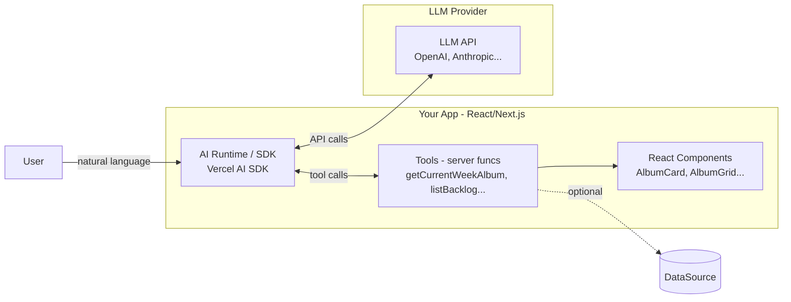
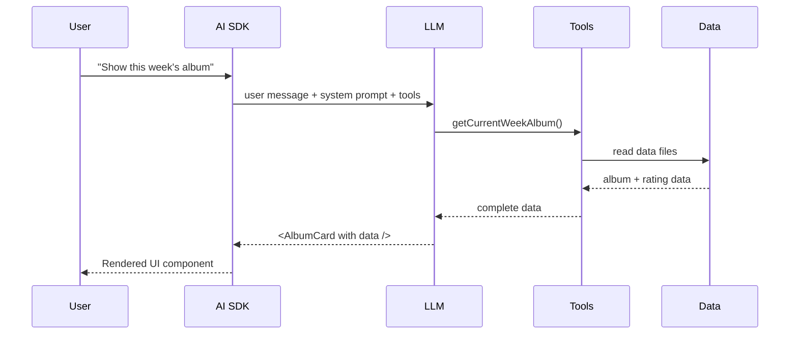

# GenUI: AI-Powered Dynamic UI Generation

GenUI enables AI models to dynamically compose React interfaces by understanding natural language, selecting tools, and
streaming composed UIs in real-time.

## Architecture

**Ownership:**
• You: components, tools, SDK config, system prompt
• AI SDK: tool orchestration, streaming
• LLM: intent parsing, tool selection, UI composition

## Request Flow

## Mental Model

**Core Roles:**
- **Runtime:** Orchestrates the conversation and streams UI
- **Tools:** Fetch and return data (not UI)
- **Components:** Render UI with the data
- **LLM:** Decides which tools to call and which components to render

**Key Principle:** Tools return data. LLM composes UI.

## Implementation

**Tools:** Return data objects, handle errors
**Components:** Pure rendering with props
**Data:** JSON files or APIs

## Basic Guidelines

• Use schemas for tool inputs/outputs
• Keep components simple and reusable
• Let the LLM handle UI composition

## Tech Talk Notes

**Value Prop:** Build blocks (components + tools), not screens. Natural language → composed UI.

**Demo:** "What's this week's album?" → tool selection → data fetch → UI composition → result